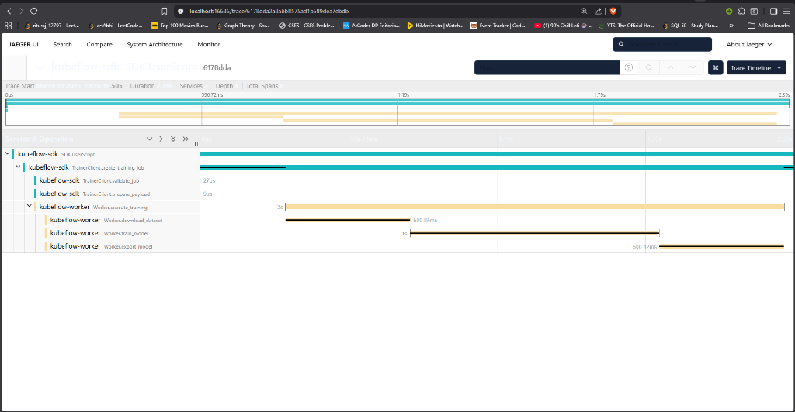

# OpenTelemetry PoC for Kubeflow SDK

## Overview & Intent
The purpose of this Proof of Concept (PoC) is to demonstrate how to seamlessly integrate **OpenTelemetry (OTel)** distributed tracing into the **Kubeflow SDK**. The key objectives are:

1. **Instrumenting the SDK**: Emitting trace spans when the SDK initiates jobs (e.g., in `TrainerClient`).
2. **Context Propagation**: Passing the trace context (Trace ID, Span ID) from the primary SDK process to an external subprocess (e.g., execution worker) via environment variables (using W3C Trace Context).
3. **Subprocess Tracing**: Allowing the subprocess to extract this context and attach its own granular spans (e.g., downloading datasets, training, exporting) as children of the original SDK span.
4. **Exporting**: Sending all generated spans from both processes to a local backend (Jaeger) for visualization.

## Trace Flow

To achieve a single, unbroken trace across process boundaries, the PoC relies on the following flow:

1. **SDK Initialization**: The user script `examples/main.py` initializes a global tracer and starts the root span (`SDK.UserScript`).
2. **TrainerClient Spans**: As the mock `TrainerClient` prepares the job, it creates child spans (e.g., `TrainerClient.validate_job`, `TrainerClient.prepare_payload`) under the active trace context.
3. **Context Injection**: Before launching the worker subprocess, the SDK extracts the active OpenTelemetry context (incorporating the current Trace ID and Span ID) and injects it into standard environment variables (such as `TRACEPARENT`, `TRACESTATE`) following the W3C Trace Context specifications.
4. **Subprocess Execution**: The worker is spawned with this expanded environment dictionary.
5. **Worker Extraction & Spans**: The `worker/worker.py` script starts, reads the `TRACEPARENT` from its environment, and rehydrates the OpenTelemetry context. All subsequent work it performs (like downloading datasets, training models) is recorded as child spans strictly under the specific SDK span that launched the worker.
6. **Unified Exporting**: Both the SDK process and the worker process independently export their generated telemetry data to the Jaeger backend. Because they share the identical Trace ID, Jaeger can visually reconstitute them into a single chronological trace.

## Component Structure

- `kubeflow/common/telemetry.py`: Acts as the centralized telemetry setup block. It encapsulates tracer initialization, OTLP exporters setup, and logic to inject/extract context. This mocks the logic that would eventually live in `kubeflow/common/telemetry/`.
- `kubeflow/sdk/trainer_client.py`: Represents the Kubeflow SDK's entrypoint. It starts a parent span (job creation, validation, payload preparation), injects the context into environment variables, and launches `worker.py` as a subprocess.
- `worker/worker.py`: Represents an out-of-process executor. It parses the trace context from its environment variables and executes nested workloads (simulated via functions like `download_dataset`, `train_model`, `export_model`), wrapping them in child spans.
- `examples/main.py`: The user script entrypoint that glues the PoC together.
- `docker-compose.yml`: Spins up a Jaeger all-in-one instance to aggregate and visualize telemetry data locally.

## Steps to Run the PoC

1. **Start the Jaeger Backend**  
   We use Jaeger to collect and view our distributed traces via its web UI.
   ```bash
   # Ensure you are in the correct directory (e.g., poc/)
   docker-compose up -d
   ```
   *Jaeger's UI will be available at [http://localhost:16686](http://localhost:16686).*

2. **Set up Python Environment & Install Dependencies**  
   Create a virtual environment and install the required OpenTelemetry packages.
   ```bash
   # Create a virtual environment
   python -m venv venv
   
   # Activate the virtual environment
   # On Windows:
   venv\Scripts\activate
   # On macOS/Linux:
   # source venv/bin/activate
   
   # Install dependencies
   pip install -r requirements.txt
   ```
   *(Alternatively, if using `uv` as previously configured, you can use `uv pip install -r requirements.txt` instead).*

3. **Run the Demonstration Script**  
   Execute the main entrypoint, which simulates the SDK user flow.
   ```bash
   python examples/main.py
   ```
   *You should see terminal outputs indicating the active `Trace ID`, the simulated tasks (validation, dataset download, etc.), and the successful subprocess completion.*

4. **Observe the Distributed Trace in Jaeger**  
   1. Open **[http://localhost:16686](http://localhost:16686)** in your web browser.
   2. Select the `kubeflow-sdk` service from the **Service** dropdown on the left.
   3. Click **Find Traces**.
   4. You will see a detailed trace that visually connects the operations in `main.py` -> `trainer_client.py` -> `worker.py`, proving that context successfully crossed the process boundary. 
   5. You can click into the trace and individually expand the spans to see custom events and metadata attributes (such as `model.loss`, `job.name`, `dataset.source`, etc.) that were attached in earlier steps.


